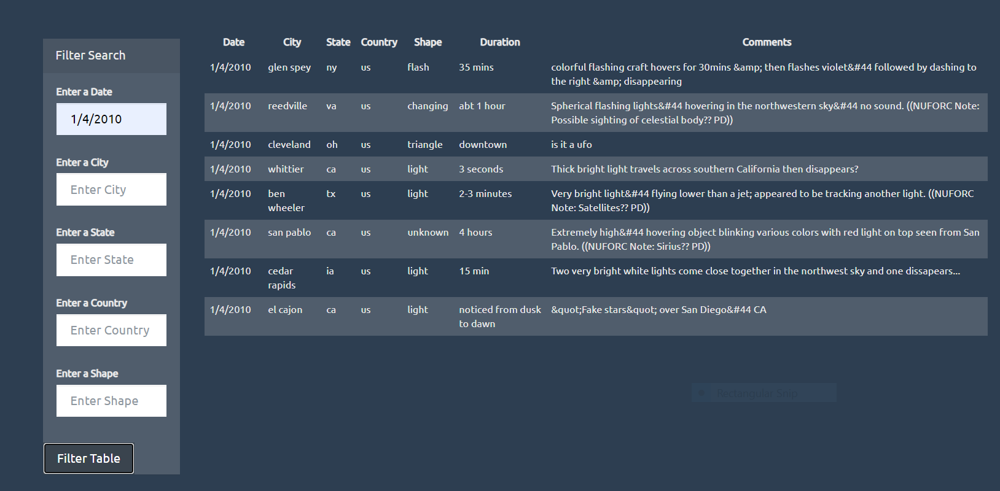
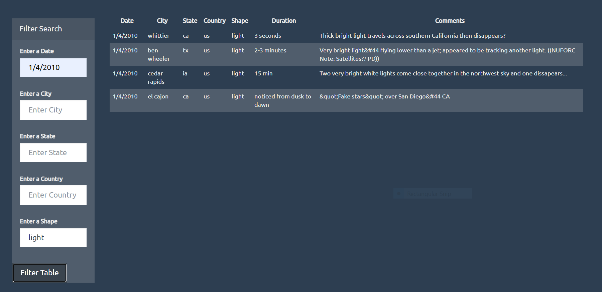
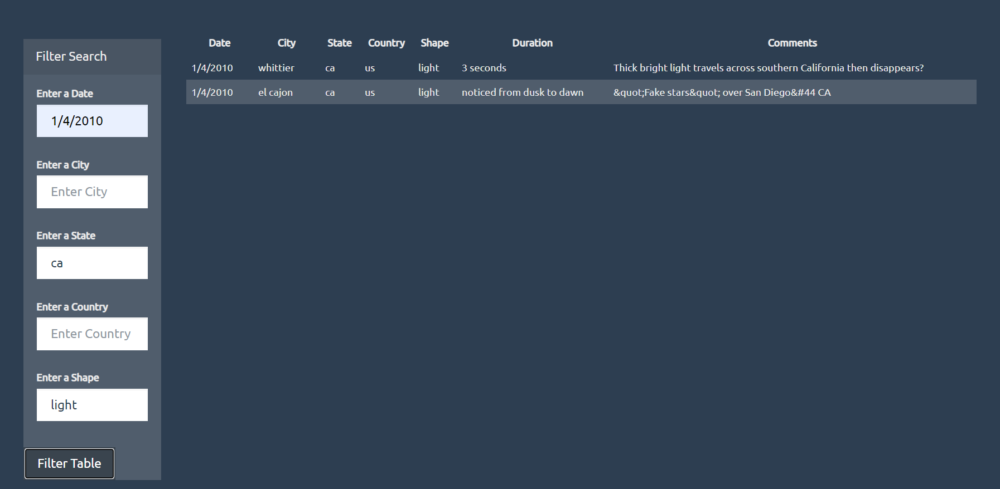
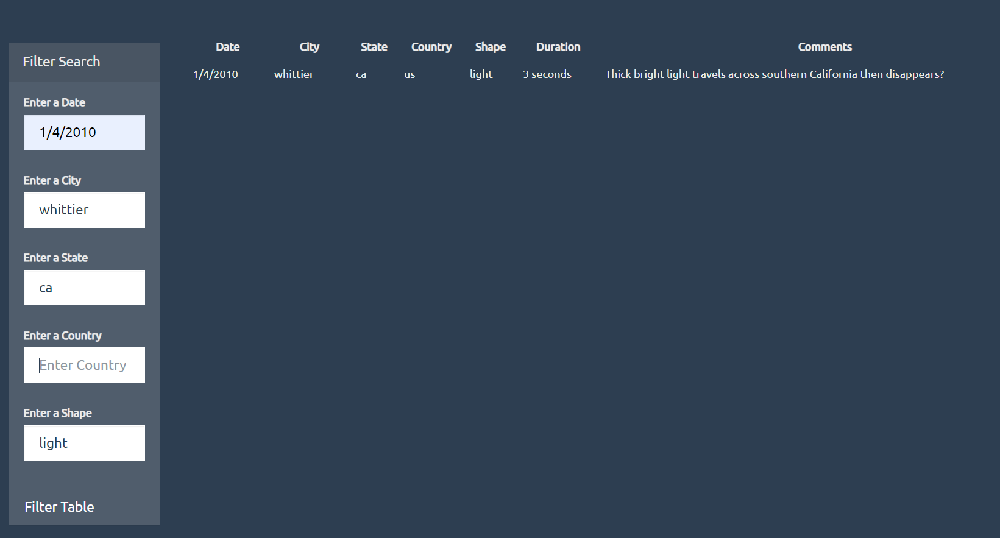

# Interactive Visualizations and Dashboards

# Table of contents:
*	General Info
*	Technologies
*	Features
*	Setup
*	Status
*	Contact

# General info:
*	Interacting with the web pages and modifying the web pages are the interesting part of the JavaScript interactive visualizations and dashboards.
*	Handling the web pages dynamically, makes the designing much easy, appealing, colorful. 

# Technologies:
*	We used visual studio code.

# Features:
*	D3, DOM manipulations, filters, event handlers, functions were used to show the data in the UFO sightings table.
*	The data is also manipulated based on the user inputs (filter search).
*	UFO sightings form with table headings and user input fields for all the columns are added in index.html.
*	Using D3 library, UFO sightings data(data.js) is displayed in table dynamically.
*	When “Filter table” button is clicked, event handlers for click action will trigger a function and data will be displayed based on user search query.

# Setup
*	There was no specific setup done to work with JavaScript. 
*	Visual studio code was used to write the index.html, app.js and data.js

# Code Examples:
* Enter Date as input  in 'Enter a Date'  field ( eg: 1/13/2010 ).
* All the data with the mentioned date will be dispalyed in the table.
* For advanced filters enter `STATE, CITY, COUNTRY, SHAPE` as input field, once the second filtered is applied, data from Step 1 is considered to filter further data.
* Same follows for all the input filters.(the order in which user enters)
is considered to filter and further filtered data is based on previous filtered data content.

## Show examples of usage:
* Filter `Date` with '1/4/2010' [data table displays with 6 rows].
* Then Add filter `Shape` with 'light' value [data will be filtered based on user inputs and 4 rows will be displayed]
* Then filter the data based on `State` with 'ca' value [This would result in filtering the data and displays two rows.]
*Finally filter the data using 'City' with 'whittier' [his would result in filtering the data and displays one row which matches all the user inputs]

# Status
Project is finished

# Contact
## D. Sai Prasanna

